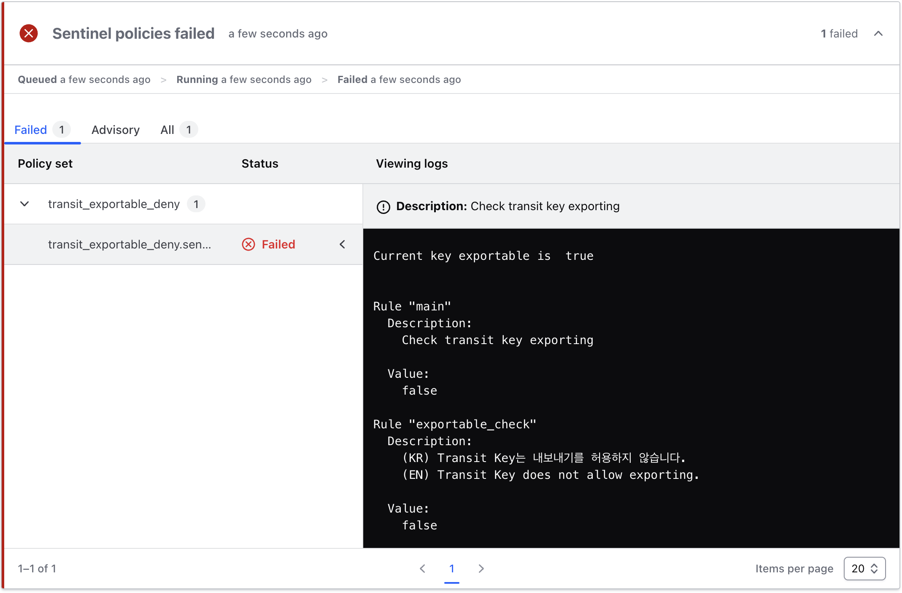

# Transit Key Exportable Deny

> Vault의 Sentinel 형태는 다음을 참고하세요.
>
> [Vault - transit_exportable_deny](./docs/policies/transit_exportable_deny.md)

## 1. Terraform Sample

[main.tf](./policies/terraform/main.tf)

```hcl
resource "vault_transit_secret_backend_key" "key" {
  backend    = vault_mount.transit.path
  name       = "my-key-name"
  exportable = true
}
```

## 2. Policy

```hcl
import "tfplan-functions" as plan

transit_key = plan.find_resources("vault_transit_secret_backend_key")

# (KR) Transit Key는 내보내기를 허용하지 않습니다.
# (EN) Transit Key does not allow exporting.
exportable_check = rule {
    all transit_key as _, rc {
      print("Current key exportable is ", rc.change.after.exportable) and
      (rc.change.after.exportable is false)
    }
}

# Check transit key exporting
main = rule {
  exportable_check
}
```

- exportable_check : 모든 transit key 유형의 리소스의 `exportable`의 값이 `false`인 경우에 `TRUE` 반환

## 3. TEST

